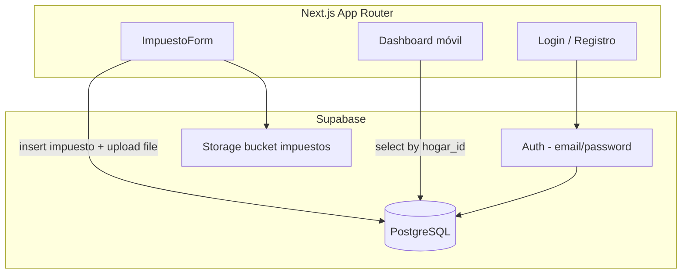
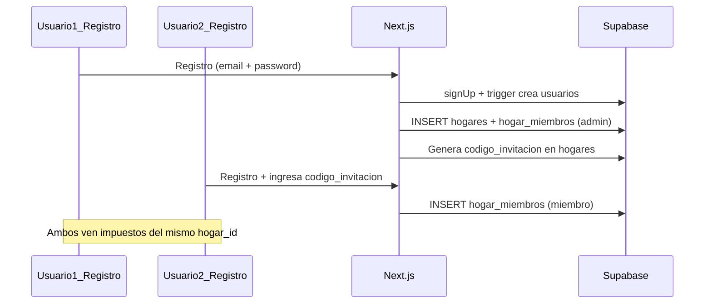

# Plan: Web App de Impuestos del Hogar

## Contexto y alcance

Workspace actual: `[f:\webbapp](f:\webbapp)` — completamente vacío. Se inicializará Next.js **en la raíz del workspace** (no en subcarpeta `webapp`, que no existe).

Alcance de esta fase:

- Bootstrap del proyecto Next.js + Tailwind
- Proyecto Supabase nuevo con tablas, RLS y Storage
- Auth email/password para 2 usuarios compartiendo un hogar
- Formulario móvil para crear impuestos con archivos (PDF/fotos)
- Listado básico de impuestos del hogar

Campos de impuesto (confirmados): **nombre, monto, fecha de vencimiento, estado (pendiente/pagado)** + archivo adjunto.

---

## Arquitectura




### Modelo de datos

Tablas solicitadas + tabla puente necesaria para compartir el hogar entre 2 usuarios:


| Tabla            | Propósito                                        |
| ---------------- | ------------------------------------------------ |
| `usuarios`       | Perfil extendido de `auth.users` (nombre, email) |
| `hogares`        | Entidad del hogar compartido                     |
| `hogar_miembros` | Relación N:M usuario ↔ hogar (esencial para RLS) |
| `impuestos`      | Impuestos con `hogar_id` compartido              |


```sql
-- Esquema propuesto (supabase/migrations/001_initial_schema.sql)

usuarios (
  id uuid PK references auth.users,
  nombre text,
  email text,
  created_at timestamptz
)

hogares (
  id uuid PK,
  nombre text default 'Mi hogar',
  created_at timestamptz
)

hogar_miembros (
  id uuid PK,
  hogar_id uuid FK -> hogares,
  usuario_id uuid FK -> usuarios,
  rol text default 'miembro',  -- 'admin' | 'miembro'
  unique(hogar_id, usuario_id)
)

impuestos (
  id uuid PK,
  hogar_id uuid FK -> hogares,
  nombre text not null,
  monto numeric(12,2) not null,
  fecha_vencimiento date not null,
  estado text check (estado in ('pendiente','pagado')) default 'pendiente',
  archivo_url text,           -- path en Storage
  archivo_nombre text,        -- nombre original del archivo
  creado_por uuid FK -> usuarios,
  created_at timestamptz
)
```

**Storage:** bucket `impuestos-archivos` (privado), estructura de path: `{hogar_id}/{impuesto_id}/{filename}`.

**RLS (Row Level Security):** cada usuario solo accede a filas cuyo `hogar_id` esté en sus membresías activas en `hogar_miembros`.

---

## Fase 1 — Bootstrap del proyecto Next.js

Ejecutar en `f:\webbapp`:

```bash
npx create-next-app@latest . --typescript --tailwind --eslint --app --src-dir=false --import-alias="@/*"
```

Dependencias adicionales:

```bash
npm install @supabase/supabase-js @supabase/ssr
```

Archivos de entorno (`.env.local`):

```
NEXT_PUBLIC_SUPABASE_URL=https://<project>.supabase.co
NEXT_PUBLIC_SUPABASE_ANON_KEY=<anon_key>
```

Estructura de carpetas resultante:

```
f:\webbapp/
├── app/
│   ├── (auth)/
│   │   ├── login/page.tsx
│   │   └── registro/page.tsx
│   ├── (app)/
│   │   ├── layout.tsx          # shell móvil con nav
│   │   ├── page.tsx            # dashboard / listado impuestos
│   │   └── impuestos/
│   │       └── nuevo/page.tsx  # formulario
│   ├── auth/callback/route.ts  # OAuth callback (reserva)
│   └── layout.tsx
├── components/
│   ├── ImpuestoForm.tsx        # formulario principal
│   ├── ImpuestoList.tsx
│   └── ui/                     # inputs, botones reutilizables
├── lib/
│   └── supabase/
│       ├── client.ts           # browser client
│       ├── server.ts           # server client (cookies)
│       └── middleware.ts       # session refresh
├── middleware.ts               # proteger rutas (app)/*
├── supabase/
│   └── migrations/
│       └── 001_initial_schema.sql
└── types/
    └── database.ts             # tipos TypeScript del esquema
```

---

## Fase 2 — Configuración Supabase (proyecto nuevo)

Pasos manuales en [supabase.com](https://supabase.com):

1. Crear proyecto → elegir región cercana (ej. South America)
2. Copiar **Project URL** y **anon public key** → `.env.local`
3. En **SQL Editor**, ejecutar `[supabase/migrations/001_initial_schema.sql](supabase/migrations/001_initial_schema.sql)` con:
  - Creación de tablas
  - Habilitación de RLS en todas las tablas
  - Políticas: SELECT/INSERT/UPDATE/DELETE restringidas por membresía en `hogar_miembros`
  - Trigger `on_auth_user_created`: auto-insert en `usuarios` al registrarse
4. En **Storage**, crear bucket `impuestos-archivos` (privado) con política: usuarios autenticados pueden subir/leer archivos de su hogar
5. En **Authentication → Providers**, habilitar Email (password)

### Políticas RLS clave (ejemplo impuestos)

```sql
-- Un usuario ve impuestos de hogares donde es miembro
create policy "impuestos_select" on impuestos for select
  using (hogar_id in (
    select hogar_id from hogar_miembros where usuario_id = auth.uid()
  ));
```

Misma lógica para INSERT (con `creado_por = auth.uid()`) y UPDATE.

---

## Fase 3 — Autenticación y flujo de hogar compartido

Flujo para pareja (2 usuarios, 1 hogar):




Implementación:

- Al registrarse el **primer usuario**, se crea automáticamente un `hogar` y se le asigna como `admin`
- Campo `codigo_invitacion` (6 chars) en `hogares` para que el segundo usuario se una
- Página `[app/(auth)/registro/page.tsx](app/(auth)`/registro/page.tsx): campo opcional "Código de invitación"
- `[middleware.ts](middleware.ts)`: redirigir no autenticados a `/login`; autenticados fuera de `(auth)` a dashboard

Clientes Supabase siguiendo patrón oficial `@supabase/ssr`:

- `[lib/supabase/client.ts](lib/supabase/client.ts)` — componentes cliente
- `[lib/supabase/server.ts](lib/supabase/server.ts)` — Server Components y Route Handlers

---

## Fase 4 — Componente ImpuestoForm

Archivo principal: `[components/ImpuestoForm.tsx](components/ImpuestoForm.tsx)`

**Campos del formulario:**


| Campo             | Tipo input | Validación                               |
| ----------------- | ---------- | ---------------------------------------- |
| nombre            | text       | required, min 2 chars                    |
| monto             | number     | required, > 0                            |
| fecha_vencimiento | date       | required                                 |
| estado            | select     | pendiente / pagado                       |
| archivo           | file       | opcional; PDF, JPG, PNG, WEBP; max 10 MB |


**Flujo de submit (client-side):**

1. Validar campos con estado local React (`useState` + validación manual, sin librería extra)
2. Obtener `hogar_id` del usuario autenticado (query a `hogar_miembros`)
3. Insertar fila en `impuestos` (sin archivo aún) → obtener `impuesto.id`
4. Si hay archivo: `supabase.storage.from('impuestos-archivos').upload(...)`
5. Actualizar `impuestos.archivo_url` y `archivo_nombre`
6. Redirigir a dashboard con toast/feedback de éxito

**UI móvil (Tailwind):**

- Layout single-column, inputs full-width, `min-h-[48px]` para touch targets
- Botón sticky bottom "Guardar impuesto"
- Preview del archivo seleccionado (nombre + icono PDF/imagen)
- Estados: loading, error, success

Ejemplo de estructura del componente:

```tsx
// components/ImpuestoForm.tsx (esqueleto)
'use client'
export function ImpuestoForm({ hogarId }: { hogarId: string }) {
  // state: form fields, file, loading, error
  async function handleSubmit(e: FormEvent) {
    // 1. validate → 2. insert impuesto → 3. upload file → 4. update url → 5. redirect
  }
  return (
    <form onSubmit={handleSubmit} className="flex flex-col gap-4 p-4 pb-24">
      {/* inputs móvil-first */}
    </form>
  )
}
```

---

## Fase 5 — Dashboard y listado

`[app/(app)/page.tsx](app/(app)`/page.tsx):

- Server Component que consulta impuestos del hogar del usuario
- Tarjetas con: nombre, monto formateado (`Intl.NumberFormat`), fecha vencimiento, badge de estado
- FAB o botón fijo "Nuevo impuesto" → `/impuestos/nuevo`
- Indicador visual si vencimiento está próximo (< 7 días)

`[components/ImpuestoList.tsx](components/ImpuestoList.tsx)`: componente presentacional de la lista.

---

## Fase 6 — Tipos y utilidades

`[types/database.ts](types/database.ts)`: interfaces `Usuario`, `Hogar`, `Impuesto`, `HogarMiembro`.

Utilidades en `[lib/utils.ts](lib/utils.ts)`:

- `formatMonto(monto: number): string` — formato ARS/USD según locale
- `formatFecha(fecha: string): string`

---

## Decisiones de diseño tomadas

- **Un hogar por pareja** con código de invitación (simple, sin email invites complejos)
- **RLS estricto** — seguridad a nivel DB, no solo frontend
- **Archivos en Storage privado** — URLs firmadas para descarga (no URLs públicas)
- **Sin librería de forms** (react-hook-form/zod) en v1 — validación manual para minimizar dependencias; se puede agregar después
- **Mobile-first** responsive, sin PWA en esta fase
- **Idioma UI: español**

---

## Orden de implementación

1. `create-next-app` + dependencias Supabase + `.env.local.example`
2. Migración SQL completa (tablas + RLS + trigger + Storage policies)
3. Clientes Supabase + middleware de auth
4. Páginas login/registro con flujo de hogar
5. `ImpuestoForm` con upload de archivos
6. Dashboard con listado
7. Prueba end-to-end: registrar 2 usuarios, unir al hogar, crear impuesto con PDF

## Verificación manual

- [ ] Registro usuario 1 → se crea hogar + código invitación visible
- [ ] Registro usuario 2 con código → ambos ven el mismo listado vacío
- [ ] Crear impuesto con PDF → aparece en dashboard de ambos usuarios
- [ ] Crear impuesto con foto JPG → upload y preview OK
- [ ] Usuario no autenticado no accede a `/impuestos/nuevo`
- [ ] Usuario de otro hogar no ve impuestos ajenos (RLS)